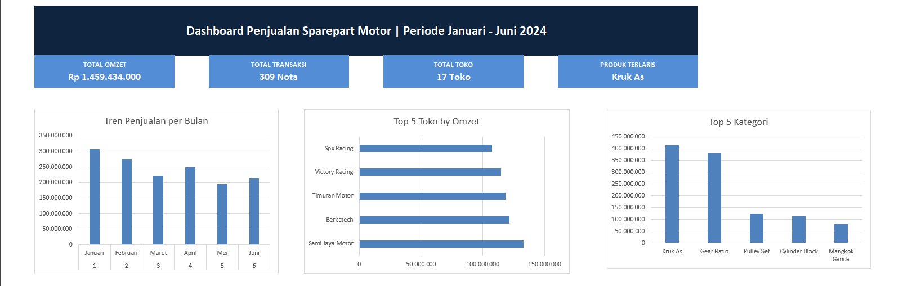

# Analisis Penjualan Sparepart Motor B2B
### End-to-End Data Analysis Project | Excel

---

## Dashboard Preview

> *Dashboard interaktif menampilkan KPI utama, tren penjualan bulanan, top 5 toko, dan top 5 kategori produk.*

---

## Latar Belakang Project

Project ini merupakan simulasi analisis data penjualan distributor sparepart motor B2B
selama 6 bulan (Januari – Juni 2024). Data mencakup transaksi penjualan ke 17 toko
dan bengkel di wilayah Jawa Tengah, Jawa Timur, Jawa Barat, dan Banten.

> **Catatan:** Data pada project ini bersifat simulasi yang dibuat berdasarkan pola bisnis nyata
> dari pengalaman 8 tahun sebagai Sales Distributor Sparepart Motor.

---

## Tujuan Analisis

1. Mengidentifikasi tren penjualan bulanan
2. Menentukan pelanggan paling valuable (top customer)
3. Menemukan kategori produk terlaris
4. Membandingkan pola penjualan antar wilayah
5. Menghasilkan insight dan rekomendasi bisnis yang actionable

---

## Struktur Data

| Kolom | Deskripsi |
|---|---|
| No Nota | ID unik transaksi |
| Tanggal | Tanggal transaksi |
| Nama Toko | Nama pelanggan (B2B) |
| Kota | Kota pelanggan |
| Provinsi | Provinsi pelanggan |
| Nama Produk | Nama sparepart |
| Kategori Produk | Jenis kategori sparepart |
| Spesifikasi | Detail ukuran/spesifikasi |
| Qty | Jumlah unit |
| Harga Satuan | Harga per unit (Rp) |
| Total Harga | Total nilai transaksi (Rp) |
| Bulan | Angka bulan (1–6) |
| Nama Bulan | Nama bulan (Januari–Juni) |
| Wilayah | Kelompok wilayah (Jateng-Jatim / Jabar-Banten) |

**Total Data:** 1.263 baris transaksi | 309 nota | 17 toko pelanggan

---

## Tools yang Digunakan

- **Microsoft Excel** — Data cleaning, Pivot Table, Dashboard, Visualisasi

---

## Tahapan Analisis

### 1. Data Preparation
- Membuat data simulasi berdasarkan pola bisnis nyata
- Menyusun 3 sheet: Data Penjualan, List Harga Produk, Master Toko

### 2. Data Cleaning
- Penomoran No Nota secara kronologis (TWH-0001 s/d TWH-0309)
- Menambahkan kolom Bulan, Nama Bulan, dan Wilayah
- Validasi Total Harga = Qty × Harga Satuan (100% clean)

### 3. Exploratory Data Analysis (EDA)
Membuat 4 Pivot Table:
- **PT - Bulanan:** Tren penjualan per bulan
- **PT - Toko:** Ranking pelanggan by omzet
- **PT - Kategori:** Produk terlaris by kategori
- **PT - Wilayah:** Perbandingan pola pembelian antar wilayah

### 4. Dashboard
Dashboard interaktif berisi:
- 4 KPI Cards (Total Omzet, Total Transaksi, Total Toko, Produk Terlaris)
- Chart Tren Penjualan per Bulan
- Chart Top 5 Toko by Omzet
- Chart Top 5 Kategori Produk

---

## Key Findings & Business Insights

### 1. 📈 Tren Penjualan Musiman
- Januari tertinggi **(Rp 307 jt)** karena momentum restocking awal tahun
- Mei terendah **(Rp 195 jt)** bertepatan dengan bulan Ramadan
- **Rekomendasi:** Siapkan stok penuh di Desember, buat program promo khusus Ramadan

### 2. 🏆 Pelanggan Terbaik
- Sami Jaya Motor Karawang adalah pelanggan #1 dengan **Rp 132 juta**
- Karawang sebagai kota industri menciptakan demand sparepart yang tinggi dan stabil
- **Rekomendasi:** Program loyalitas khusus untuk top customer

### 3. ⚠️ Risiko Ketergantungan Produk
- Kruk As + Gear Ratio = **54% total omzet (Rp 794 juta)**
- Terlalu bergantung pada 2 kategori = risiko bisnis tinggi
- **Rekomendasi:** Diversifikasi ke Cylinder Block dan Pulley Set

### 4. 🗺️ Persaingan Ketat di Jabar-Banten
- Jabar-Banten **44% omzet**, didominasi produk matic dengan banyak kompetitor
- **Rekomendasi:** Fokus produk matic premium, jual value bukan harga

### 5. 📉 Pelanggan Berpotensi Rendah
- Mediapart & Medan Motor di posisi terbawah karena hambatan harga premium
- **Rekomendasi:** Ubah pendekatan sales — edukasi toko tentang value kualitas premium

---

## Summary Hasil Analisis

| Metrik | Nilai |
|---|---|
| Total Omzet 6 Bulan | Rp 1.459.434.000 |
| Total Transaksi | 309 Nota |
| Total Pelanggan | 17 Toko |
| Produk Terlaris | Kruk As (Rp 413 jt) |
| Toko Terbaik | Sami Jaya Motor Karawang |
| Bulan Terbaik | Januari (Rp 307 jt) |
| Kontribusi Top 2 Produk | 54% Total Omzet |

---

## Challenges & Learning

**Tantangan yang dihadapi:**
- Membuat data simulasi yang realistis dan konsisten secara logika bisnis — misalnya memastikan pola seasonal sesuai dengan kondisi pasar nyata (restocking awal tahun, penurunan saat Ramadan)
- Merancang struktur Pivot Table yang efisien agar dashboard tetap responsif dengan 1.263 baris data

**Yang dipelajari dari project ini:**
- Pentingnya data cleaning sebelum analisis — validasi formula Total Harga memastikan tidak ada error kalkulasi
- Domain knowledge bisnis sangat membantu dalam menginterpretasikan angka menjadi insight yang actionable, bukan sekadar membaca chart
- Visualisasi yang sederhana dan bersih lebih efektif daripada dashboard yang terlalu ramai

---

## Domain Knowledge

Project ini didukung oleh **8 tahun pengalaman langsung** sebagai Sales Distributor
Sparepart Motor di wilayah Jawa, yang memberikan konteks bisnis mendalam:

- Pemahaman pola seasonal penjualan sparepart motor
- Pengetahuan karakteristik pasar Jawa Tengah vs Jawa Barat
- Pemahaman dinamika kompetisi industri sparepart aftermarket
- Insight tentang tren kebangkitan motor 2 tak di komunitas balap lokal

---

## Author

**Bayu Fajar Pradana**  
Career Switcher | Ex-Sales Distributor → Data Analyst

- 📧 [bayufp1717@gmail.com](mailto:bayufp1717@gmail.com)
- 💼 [linkedin.com/in/bayu-f-pradana](https://www.linkedin.com/in/bayu-f-pradana)

---

*Project ini dibuat sebagai bagian dari portofolio Data Analyst*
